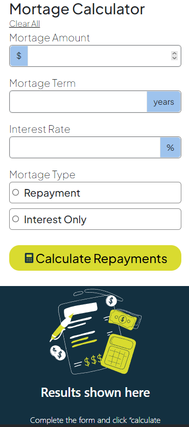
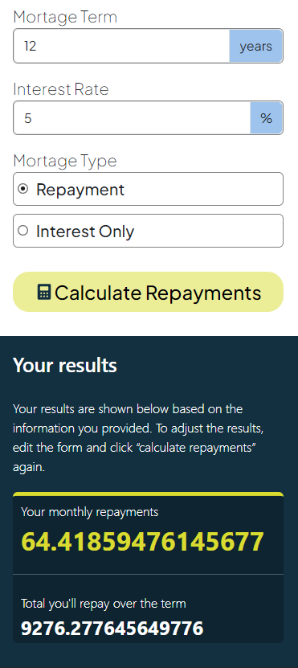

# Frontend Mentor - Mortgage repayment calculator solution

This is a solution to the [Mortgage repayment calculator challenge on Frontend Mentor](https://www.frontendmentor.io/challenges/mortgage-repayment-calculator-Galx1LXK73). Frontend Mentor challenges help you improve your coding skills by building realistic projects.

## Table of contents

- [Overview](#overview)
  - [The challenge](#the-challenge)
  - [Screenshot](#screenshot)
  - [Links](#links)
- [My process](#my-process)
  - [Built with](#built-with)
  - [What I learned](#what-i-learned)
  - [Continued development](#continued-development)
  - [Useful resources](#useful-resources)
- [Author](#author)
- [Acknowledgments](#acknowledgments)

## Overview

Website that calculates the mortgage amount with an appealing design and styling

### The challenge

Users should be able to:

- Input mortgage information and see monthly repayment and total repayment amounts after submitting the form
- See form validation messages if any field is incomplete
- View the optimal layout for the interface depending on their device's screen size
- See hover and focus states for all interactive elements on the page

### Screenshot

 

### Links

- Solution URL: [Mortgage Calculator Website](https://github.com/kayan2004/mortgage-calculator-website)

## My process

I started my project first by building the html structure, then, I went on and started styling from top to bottom. I also modified by html structure to be able to do certain things in my CSS files. Finally, after finishing the styles for the empty state, I added the styles for the other states using javascript. Later, I went on and coded the mortgage calculation in javascript. And in the end, I wrote the CSS for different screen sizes.

### Built with

- Semantic HTML5 markup
- CSS custom properties
- Flexbox
- Mobile-first workflow
- [Bootstrap](https://getbootstrap.com) - For the form

### What I learned

I mostly learned how to structure my index.html file so it would be easy for me to style it later. I also learned how to use a flexbox. I learned how to ass styles that are dependent on the state of the html element which was mostly done using javascript.

For example, I was proud that i was able to that method by myself and manipulate html elements depending on their state

```js
var focusStateHandler = () => {
  const inputGroups = document.querySelectorAll(".input-group");
  inputGroups.forEach((inputGroup) => {
    const inputElement = inputGroup.querySelector(".child");
    let spanElement = inputGroup.querySelector(".input-group-text");
    inputElement.addEventListener("focus", () => {
      inputGroup.classList.add("focus");
      spanElement.classList.add("span-focus-state");
    });
    inputElement.addEventListener("blur", () => {
      spanElement.classList.remove("span-focus-state");
      inputGroup.classList.remove("focus");
    });
  });
};
```

### Continued development

For future projects, I want to focus on styling for different screen sizes because this was the hardest task for me in this project. Although I used the mobile-first approach, the use of media queries to style depending on screen size was very challenging for me.

### Useful resources

- [Flexbox](https://developer.mozilla.org/en-US/docs/Learn/CSS/CSS_layout/Flexbox) - This helped me understand the concept of flexbox.

## Author

- Frontend Mentor - [@kayan2004](https://www.frontendmentor.io/profile/kayan2004)
